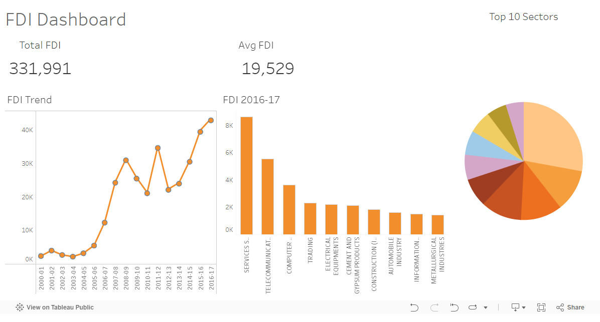

# Foreign Direct Investment (FDI) Data Analysis and Dashboard

This repository contains an exploratory data analysis (EDA) and visualization project on a dataset of Foreign Direct Investment (FDI) by companies. The objective is to analyze FDI trends and present key insights through an interactive Tableau dashboard.

## Project Overview

The project involves the following steps:
1. **Data Cleaning and Preprocessing**: Handling missing values, correcting data types, and performing feature engineering.
2. **Exploratory Data Analysis (EDA)**: Using Python to analyze data distributions, identify patterns, and detect anomalies. 
3. **Visualization**: Creating a Tableau dashboard to present key findings and metrics.

## Repository Structure

```
Foreign-Direct-Investment-Analytics/
│
├── data/
│   ├── processed/
│
├── notebooks/
│   └── EDA.ipynb
│
├── tableau/
│   └── FDI_Dashboard.twbx
│
├── images/
│   └── dashboard_screenshot.png
│
└── README.md
```

- **data/**: Contains processed datasets.
- **notebooks/**: Jupyter notebooks used for data cleaning and exploratory data analysis.
- **tableau/**: Tableau workbook file containing the dashboard.
- **images/**: Screenshot of the Tableau dashboard.

## Tableau Dashboard

The Tableau dashboard provides insights into:
- Yearly trends and patterns in FDI
- Top sectors attracting FDI.



## Contributing

Contributions are welcome! Please open an issue or submit a pull request for any improvements or bug fixes.

## License

This project is licensed under the MIT License. See the [LICENSE](LICENSE) file for details.
